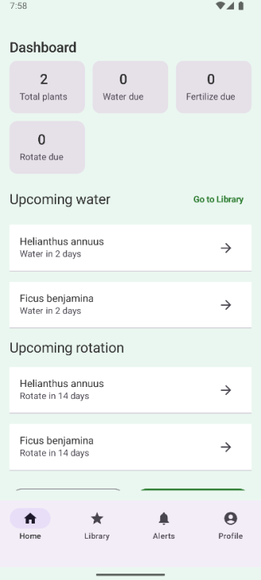

# PlantPal 🌱

**Gamified houseplant care, right on your phone.**



---

## Overview

PlantPal is an Android app that turns plant care into a delightful game—think modern Tamagotchi vibes for your real plants. Snap a photo to add a plant, and PlantPal creates a cute digital avatar that reacts to your care: water on time and it perks up, forget and it droops. With AI-powered identification (planned), personalized care reminders, and friendly gamification, PlantPal makes plant parenting simple and fun.

---

## Features

### ✅ Core (MVP)

* **Secure Accounts** – Sign up and log in with Firebase Authentication
* **Add Plants by Photo** – Capture images in-app to register new plants
* **Digital Avatars** – Each plant gets a unique, charming avatar
* **Plant Profiles** – Store common & scientific names, photos, and personal notes
* **Care Logs** – Track watering, fertilizing, and other activities
* **Cloud Sync** – Plant data stored in **Firebase Firestore** (with local photo storage via `FileProvider`)

###  In Development

* **AI Plant Recognition** – Identify species from photos
* **Personalized Care Profiles** – Automated schedules by species
* **Smart Reminders** – Push notifications for watering, rotation, fertilizing
* **Avatar Health System** – Moods/health reflect real-world care patterns

###  Upcoming 

* **Multi-Plant Dashboard** – At-a-glance health & status
* **Achievement System** – Badges for healthy streaks
* **Social Sharing** – Post avatars and milestones

---

## Tech Stack

**Platform & Language**

* Android (Native) • Kotlin • Jetpack Compose

**Android Versions**

* **Min SDK:** 24 (Android 7.0 Nougat)
* **Compile SDK:** 36
* **Target SDK:** 36

**Architecture & Libraries**

* **Navigation:** Jetpack Navigation Compose
* **State & Lifecycle:** AndroidX Lifecycle + ViewModel
* **Async:** Kotlin Coroutines & Flow
* **Camera & Media:** Android Camera API with `FileProvider`

**Backend & Cloud**

* **Firebase Authentication** – Accounts & sessions
* **Firebase Firestore** – NoSQL database for profiles & logs
* **Firebase Storage** – Plant photos *(planned)*
* **Firebase Cloud Messaging** – Reminders *(planned)*


---

## Installation

### For End Users

1. **Download the APK** (from the repo’s *Releases* page, when available).
2. **Enable Unknown Sources** on your device:

   * *Settings → Security (or Privacy) → Install unknown apps* → Allow for your browser/files app.
3. **Install PlantPal** by opening the downloaded APK.
4. **Create an Account** and sign in.
5. **Add Your First Plant** by tapping **“+”** and taking a photo.

**System Requirements**

* Android 7.0 (API 24) or higher
* Camera recommended
* Internet connection for cloud sync

---

## Development Setup

### Prerequisites

* **Android Studio:** Koala Feature Drop (2024.1.2) or later
* **JDK:** 11+
* **Gradle:** 8.13
* **Firebase project:** for Auth & Firestore

### 1) Clone the Repository

```bash
git clone https://github.com/yourusername/plantpal.git
cd plantpal
```

### 2) Open in Android Studio

* Launch Android Studio → **Open an Existing Project** → select the `plantpal` directory.

### 3) Configure Firebase

1. Create a new project in the **Firebase Console**.
2. Add an **Android app** with the package name: `com.example.plantpal`.
3. Download `google-services.json`.
4. Place it in the project at:

   ```
   app/google-services.json
   ```
5. In Firebase Console, enable:

   * **Authentication** → Email/Password
   * **Cloud Firestore**

> **Note:** Firebase Storage & Cloud Messaging can be enabled later as those features roll out.

### 4) Sync & Build

* Android Studio will prompt you to **Sync Gradle**.
* If not, use **File → Sync Project with Gradle Files**.

**Build Configuration**

* **Gradle:** 8.13 (via `gradle-wrapper.properties`)
* **Build Variants:** Debug / Release
* **Compile SDK:** 36
* **Min SDK:** 24

### 5) Run the App

* Connect a device or start an emulator (API 24+).
* Click **Run** (▶) or press **Shift + F10**.
* Select your target device.

---

## Project Status

### ✅ Completed Milestones

* User authentication (sign up/login)
* Firestore integration
* Camera integration for plant photos
* Basic plant profile storage
* Bottom navigation
* Multi-plant dashboard with health indicators
* Local photo storage with `FileProvider`
* AI plant identification (Plant.id integration)
* Avatar generation system
* Care reminder notifications
* Plant health tracking

### 🔄 In Progress


### 📋 Next Up (Beta)


* Achievement/badge system
* Social sharing features

---

## Roadmap

**v1.0 (Target: TBD)**

* Full AI plant identification
* Automated care schedules
* Push notification system
* Avatar health system with animations
* Achievement badges

**v2.0 (Future)**

* Community features (forums, plant trading)
* Web dashboard companion app
* Avatar customization marketplace

---

## Contributors

* **Joshua Lindgren** – Frontend Development
* **Devin McLaughlin** – UX/UI Design
* **Ethan LeFebvre** – Backend Development

---

## Contributing

Have ideas or found a bug? Issues and PRs are welcome!

---

## License

**MIT License** — © 2025 PlantPal Team
See the [LICENSE](./LICENSE) file for the full text.

---

## Acknowledgments

* **Full Sail University** for guidance and support
* **Firebase** for backend infrastructure
* The **Android/Jetpack Compose** community for docs and examples
* **Plant.id** for the plant recognition API